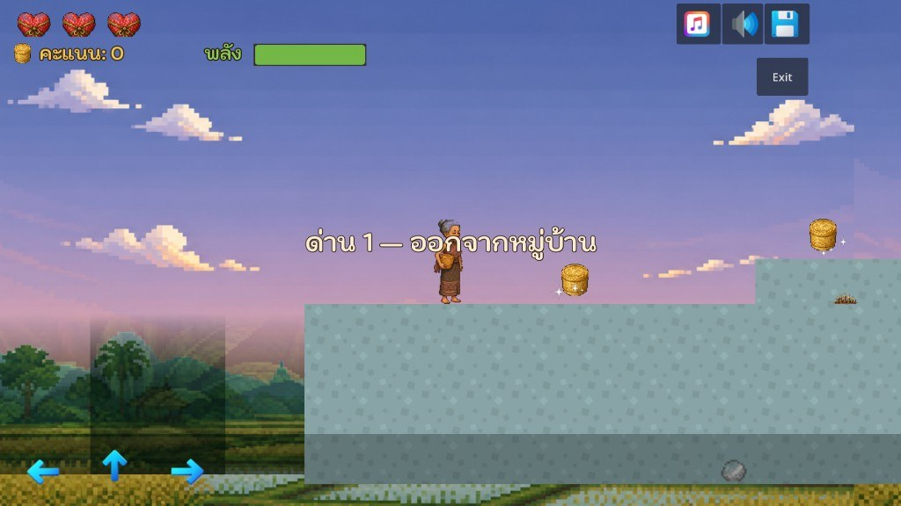

# กล่องข้าวน้อย (A Mother's Walk) — Midterm Project

**รายวิชา:** CP410844 Computer Game Development  
**วิทยาลัยการคอมพิวเตอร์ มหาวิทยาลัยขอนแก่น**  
**กลุ่มที่ 4**

---

## ผู้จัดทำ

1. **673380348-4** นายสรวิศ สำราญบึงแก
2. **673380308-6** นายจักรภัทร เวียงสิมมา
3. **673380328-0** นายพรหมพัฒน ศิริภัคกุลวัฒน์

---

## คำอธิบายโครงการ

เกม **"กล่องข้าวน้อย (A Mother's Walk)"** เป็นเกม 2D Platformer ที่ตีความนิทานพื้นบ้านไทยใหม่ในมุมของมารดา  
ผู้เล่นเป็นแม่ของไอ้ทอง เดินทางนำกล่องข้าวไปส่งลูกผ่าน **6 ด่าน** ต้องหลบศัตรู กับดัก ช่วยชาวบ้าน และบริหารหลอดความอดทนของไอ้ทอง

### ฟีเจอร์หลัก

- ธีมสมุดนิทานไทย: พื้นหลังสีน้ำ parallax 6 ด่าน, บทนำ 6 หน้า, HUD หมึกบนกระดาษ
- หลอดความอดทนของไอ้ทอง (หมดแล้วแพ้) และกระติบข้าว 8 ใบสำหรับตอนจบสุข
- กระสุนหินจำกัด + เก็บก้อนหินเติม
- จุดพัก / ช่วยชาวบ้าน / ศาลเทวดามินิเกม / ปริศนาดันหิน
- หมูป่า–ควายตายยาก + ดาเมจตอนชนต่างกัน
- ตั้งค่าเสียงแบบสไลเดอร์ + หน้าหยุดเกม (Esc)

### ด่าน

1. ออกจากหมู่บ้าน — เช้าตรู่  
2. ป่าไผ่ — สาย  
3. ทางขรุขระ — เที่ยง  
4. ทุ่งนากลางทาง — บ่ายแก่  
5. คูน้ำกลางคืน — พลบค่ำ  
6. ส่งกล่องข้าวให้อ้ายทอง — แสงสุดท้าย  

### ภาพตัวอย่าง

### ลิงก์

- **รายงานโครงงาน:** [docs/midterm-report.docx](docs/midterm-report.docx)
- **GitHub Project:** [ppppppwaqrd/a-mothers-walk-midterm](https://github.com/ppppppwaqrd/a-mothers-walk-midterm)
- **Play (GitHub Pages):** [เล่นเกม](https://ppppppwaqrd.github.io/a-mothers-walk-midterm/)
- **itch.io:** [wsm-jkp.itch.io/amotherswalk](https://wsm-jkp.itch.io/amotherswalk)
- **Lab 04 (ส่งแล้ว):** [lab04-a-mothers-walk](https://github.com/ppppppwaqrd/lab04-a-mothers-walk)

---

## การควบคุม

| ปุ่ม | การกระทำ |
|---|---|
| **A / Left** | เดินซ้าย |
| **D / Right** | เดินขวา |
| **Space** | กระโดด |
| **J** | ปาหิน / โจมตี |

---

## Credits

- **Engine:** Godot Engine 4.7
- **Fonts:** Charmonman, Mali (SIL Open Font License)
- **Music / SFX:** synthesized for this project (no borrowed loops)
- **Starter Kit (mechanics base):** [computingkku/2D-Platformer-Starter-Kit](https://github.com/computingkku/2D-Platformer-Starter-Kit)
